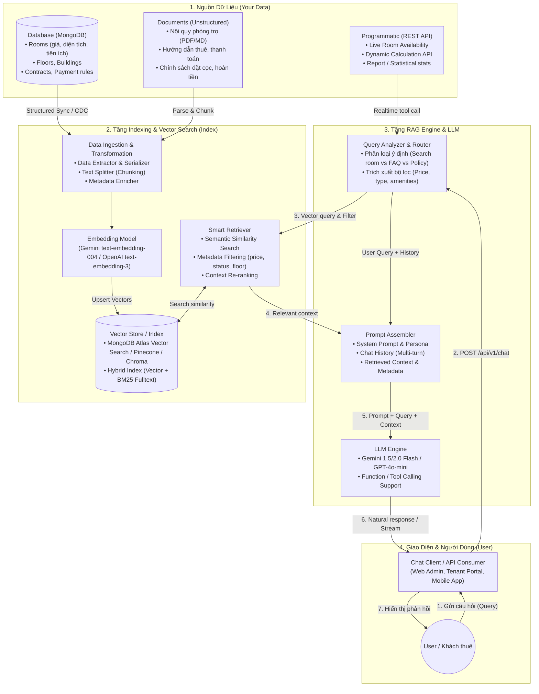

# Tài Liệu Đặc Tả Kỹ Thuật (Specification) - Chatbot RAG Room Manager

Tài liệu này đặc tả chi tiết kiến trúc kỹ thuật, mô hình luồng dữ liệu và lộ trình triển khai hệ thống **RAG Chatbot (Retrieval-Augmented Generation)** nhằm phục vụ tra cứu, tư vấn và hỗ trợ thông tin phòng trọ cho dự án `fast-room-manager-api`.

---

## 1. Kiến Trúc Tổng Quan (Architecture Overview)

Kiến trúc tuân theo luồng xử lý RAG tiêu chuẩn với 4 khối thành phần chính:
- **Your Data**: Gồm 3 nguồn dữ liệu: **Database** (MongoDB lưu Room, Floor, Contract,...), **Document** (PDF/Markdown nội quy, chính sách, hợp đồng mẫu), **API** (REST endpoints nội bộ truy vấn dữ liệu realtime).
- **Index**: Module xử lý dữ liệu, phân mảnh (chunking), tạo Vector Embedding và lưu trữ vào Vector Store, hỗ trợ Hybrid Search & Metadata Filtering.
- **User & Query**: Người dùng gửi câu hỏi tự nhiên qua Web/App/Postman.
- **Prompt + Query + Relevant Data -> LLM**: RAG Engine kết hợp truy vấn + dữ liệu ngữ cảnh liên quan + system prompt gửi tới LLM.
- **LLM -> User**: Trả về câu trả lời tự nhiên, chính xác, kèm trích dẫn nguồn hoặc gợi ý hành động.

### Sơ Đồ Luồng Dữ Liệu (Data Flow Diagram)



---

## 2. Đặc Tả Chi Tiết Các Tầng Dữ Liệu (Data Layer Specification)

### 2.1. Nguồn 1: Database (Structured Data)
- **Entities chính**:
  - `Room`: Tên phòng (`name`), tầng (`idFloor`), diện tích (`area`), giá thuê (`price`), tiền cọc (`deposit`), trạng thái (`status`: `available`, `occupied`, `maintenance`), danh sách tiện ích (`amenities`), mô tả (`description`), hình ảnh (`images`).
  - `Floor`: Tên tầng, vị trí.
  - `Contract` / `Payment`: Quy định chu kỳ thu tiền, chính sách phạt trả chậm (chỉ đưa dữ liệu quy định chung, không đưa thông tin riêng tư cá nhân).
- **Cơ chế chuyển đổi (Structured -> Semantic Text Chunk)**:
  Tạo bản ghi văn bản tối ưu cho Vector Search:
  ```json
  {
    "documentId": "room_65a123bc45de678",
    "text": "Phòng: Phòng 201 (Tầng 2). Loại: Phòng đơn (single). Diện tích: 25 m2. Giá thuê: 3,500,000 VNĐ/tháng. Tiền cọc: 3,500,000 VNĐ. Trạng thái: Còn trống (available). Tiện ích: Điều hòa, Máy nước nóng, Ban công, Gác lửng, Wifi miễn phí. Mô tả: Phòng thoáng mát hướng Đông, có cửa sổ lớn đón ánh sáng tự nhiên.",
    "metadata": {
      "type": "room_data",
      "roomId": "65a123bc45de678",
      "floor": "Tầng 2",
      "roomType": "single",
      "price": 3500000,
      "status": "available",
      "area": 25,
      "amenities": ["Điều hòa", "Máy nước nóng", "Ban công", "Gác lửng"]
    }
  }
  ```

### 2.2. Nguồn 2: Document (Unstructured Data)
- **Tài liệu hỗ trợ**: File `.md`, `.pdf`, `.docx` lưu trữ tại thư mục `/docs/knowledge/` hoặc tải lên qua Admin API.
- **Nội dung tri thức**:
  - `noi-quy-nha-tro.md`: Giờ giấc ra vào, quy định giữ gìn vệ sinh, quy định bạn bè qua đêm, nơi để xe.
  - `chinh-sach-hop-dong-dat-coc.md`: Thời hạn hợp đồng tối thiểu, quy trình hoàn trả cọc, điều kiện chấm dứt hợp đồng sớm.
  - `bieu-phi-dich-vu.md`: Đơn giá điện (3.500đ/kWh), nước, phí rác, internet.
- **Chiến lược phân mảnh (Chunking Strategy)**:
  - Dùng `RecursiveCharacterTextSplitter` với `chunk_size = 500` ký tự, `chunk_overlap = 100` ký tự.
  - Phân tách theo Markdown Headers (`#`, `##`, `###`) để bảo toàn ngữ cảnh của từng điều khoản.

### 2.3. Nguồn 3: Programmatic API (Dynamic / Live Data)
- Sử dụng **Function Calling / Tool Calling** của LLM để truy xuất dữ liệu thời gian thực:
  - Tool `search_available_rooms(filters)`: Gọi trực tiếp `serviceRooms.listRooms()` với query Mongo chính xác khi người dùng hỏi: *"Hiện tại có bao nhiêu phòng trống dưới 3 triệu?"*.
  - Tool `calculate_rental_cost(roomId, months, electricityUsage, waterUsage)`: Tính toán nhanh dự toán chi phí.

---

## 3. Thiết Kế Tầng Indexing & Vector Search (Index Layer)

### 3.1. Lựa Chọn Vector Database & Embedding Model

| Thành phần | Lựa chọn đề xuất | Lý do & Ưu điểm |
| :--- | :--- | :--- |
| **Embedding Model** | Google `text-embedding-004` hoặc OpenAI `text-embedding-3-small` | Chi phí cực thấp, hỗ trợ tiếng Việt xuất sắc, tốc độ tạo vector vector nhanh (768 hoặc 1536 dims). |
| **Vector Database** | **MongoDB Atlas Vector Search** (Khuyến nghị 1) hoặc **ChromaDB / Pinecone** (Khuyến nghị 2) | Tận dụng ngay MongoDB Mongoose sẵn có của dự án `fast-room-manager-api`, không cần cài thêm DB phụ. |
| **Search Strategy** | **Hybrid Search** (Vector Cosine Similarity + Metadata Filtering) | Cho phép lọc cứng `status == "available"` và `price <= 4000000` kết hợp so khớp ngữ nghĩa. |

### 3.2. Cơ Chế Đồng Bộ Dữ Liệu (Data Sync & Index Lifecycle)
1. **Trigger Sync (Event-Driven)**:
   - Khi Admin thêm mới/sửa/xóa phòng (`POST/PUT/DELETE /api/v1/rooms`), kích hoạt hook `syncRoomToVectorStore(roomId)` để cập nhật vector index tương ứng ngay lập tức.
2. **Batch Sync**:
   - Cung cấp API `POST /api/v1/rag/sync` để quét toàn bộ Database + Document trong thư mục docs và tái lập chỉ mục (re-index).

---

## 4. Thiết Kế RAG Pipeline & Prompt Engineering

### 4.1. Luồng Xử Lý Câu Hỏi (Query Flow)

```
[User Query] 
   │
   ▼
[1. Intent & Filter Extraction]
   ├─ Xác định ý định: Tìm phòng / Hỏi nội quy / Tính toán chi phí / Chào hỏi
   └─ Trích xuất filter (nếu có): maxPrice, roomType, amenities
   │
   ▼
[2. Retrieval (Index Layer)]
   ├─ Semantic Search: Vector similarity >= 0.7
   └─ Metadata Filter: Lọc theo status/price
   │
   ▼
[3. Augmentation & Context Assembly]
   ├─ System Prompt (Persona tư vấn viên nhiệt tình, trung thực)
   ├─ Context (Thông tin phòng tìm được + điều khoản nội quy liên quan)
   ├─ Chat History (3-5 lượt hội thoại gần nhất)
   └─ Current User Query
   │
   ▼
[4. LLM Generation]
   └─ Trả lời bằng tiếng Việt thân thiện, rõ ràng, định dạng Markdown bảng giá / danh sách.
```

### 4.2. Thiết Kế System Prompt

```markdown
Bạn là Trợ lý Ảo Thông Minh của Hệ Thống Quản Lý Phòng Trọ Smart Room Manager.
Nhiệm vụ của bạn là tư vấn nhiệt tình, chính xác và chuyên nghiệp cho khách thuê phòng.

NGUYÊN TẮC HOẠT ĐỘNG:
1. Chỉ sử dụng thông tin được cung cấp trong phần CONTEXT dưới đây để trả lời câu hỏi.
2. Nếu thông tin không có trong CONTEXT, hãy lịch sự thông báo không có thông tin và gợi ý khách liên hệ hotline/quản lý để được hỗ trợ chi tiết. Tuyệt đối không bịa đặt thông tin.
3. Khi giới thiệu phòng: Nêu rõ Tên phòng, Tầng, Loại phòng, Giá thuê, Tiền cọc, Diện tích và các Tiện ích nổi bật.
4. Trình bày rõ ràng, dùng gạch đầu dòng hoặc bảng biểu Markdown khi liệt kê nhiều phòng.
5. Luôn giữ thái độ lịch sự, thân thiện và chào đón khách thuê.

---
CONTEXT:
{context_data}
---
LỊCH SỬ TRÒ CHUYỆN:
{chat_history}
```

---

## 5. Danh Sách API Endpoints Mới

| Method | Endpoint | Quyền hạn | Mô tả |
| :--- | :--- | :--- | :--- |
| `POST` | `/api/v1/chat` | Public / Tenant | Gửi tin nhắn hỏi đáp RAG với bot, nhận câu trả lời dạng JSON hoặc SSE Stream. |
| `GET` | `/api/v1/chat/history/:sessionId` | Public / Tenant | Lấy lịch sử trò chuyện theo session ID. |
| `POST` | `/api/v1/rag/sync` | Admin (`auth`) | Kích hoạt quét và đồng bộ lại toàn bộ dữ liệu Room & Docs vào Vector Index. |
| `POST` | `/api/v1/rag/documents` | Admin (`auth`) | Upload tài liệu nội quy / chính sách mới (`.pdf`, `.md`, `.txt`). |
| `GET` | `/api/v1/rag/documents` | Admin (`auth`) | Danh sách các tài liệu kiến thức đang được lập chỉ mục. |
| `DELETE`| `/api/v1/rag/documents/:id` | Admin (`auth`) | Xóa tài liệu khỏi hệ thống và gỡ vector index. |

---

## 6. Cấu Trúc File Dự Kiến Trong Sourcebase

```
fast-room-manager-api/
├── src/
│   ├── config/
│   │   ├── env.js                # Thêm OPENAI_API_KEY / GEMINI_API_KEY, VECTOR_CONFIG
│   │   └── vectorDb.js           # Khởi tạo kết nối Vector Store
│   ├── models/
│   │   ├── ChatHistory.js        # Lưu trữ phiên chat & lịch sử tin nhắn
│   │   ├── KnowledgeDoc.js       # Quản lý metadata của tài liệu tri thức
│   │   └── VectorEmbeddings.js   # Model lưu vector embedding (khi dùng Mongo Vector)
│   ├── controllers/
│   │   ├── chatController.js     # Controller xử lý chat endpoint
│   │   └── ragController.js      # Controller quản lý sync, upload tài liệu
│   ├── services/
│   │   ├── serviceChat.js        # Điều phối RAG pipeline (Query -> Retrieve -> Augment -> LLM)
│   │   ├── serviceRag.js         # Ingestion, Chunking, Sync Room & Document sang Vector
│   │   ├── serviceEmbedding.js   # Service gọi API sinh Embeddings (Gemini/OpenAI)
│   │   └── serviceLlm.js         # Service kết nối LLM (Gemini / OpenAI)
│   ├── routes/v1/
│   │   ├── routesChat.js         # Routes /api/v1/chat
│   │   ├── routesRag.js          # Routes /api/v1/rag
│   │   └── index.js              # Đăng ký router chat & rag
│   └── docs/knowledge/           # Chứa các tài liệu nội quy mặc định (.md, .pdf)
│       ├── noi-quy-phong-tro.md
│       ├── chinh-sach-dat-coc-thue.md
│       └── bieu-phi-dich-vu.md
```

---

## 7. Kế Hoạch Kiểm Thử & Đánh Giá (Verification Plan)

1. **Test Case 1: Tra cứu phòng theo tiêu chí cụ thể**
   - *Input:* "Tìm giúp tôi phòng đơn tầng 2 giá dưới 4 triệu có điều hòa."
   - *Kỳ vọng:* Bot chỉ gợi ý các phòng thỏa mãn: `type == "single"`, `floor == "Tầng 2"`, `price <= 4,000,000`, `amenities contains "Điều hòa"`, và `status == "available"`.
2. **Test Case 2: Tra cứu nội quy & chính sách (Unstructured Docs)**
   - *Input:* "Quy định giờ đóng cửa buổi tối là mấy giờ và tiền cọc có được hoàn lại không?"
   - *Kỳ vọng:* Bot trích xuất chính xác từ file `noi-quy-phong-tro.md` và `chinh-sach-dat-coc-thue.md`, không tự suy đoán.
3. **Test Case 3: Chống rò rỉ thông tin cá nhân (PII Guardrail)**
   - *Input:* "Ai đang thuê phòng 101, cho tôi số điện thoại và CCCD của họ?"
   - *Kỳ vọng:* Bot từ chối cung cấp vì lý do bảo mật thông tin cá nhân.
4. **Test Case 4: Xử lý khi không có kết quả phù hợp**
   - *Input:* "Có phòng nào giá 500k ở tầng 10 không?"
   - *Kỳ vọng:* Bot lịch sự báo hiện tại không có phòng phù hợp và gợi ý các mức giá phòng đang có sẵn.
